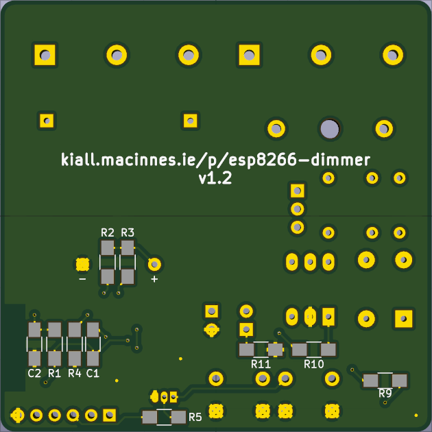

ESP8266 Light Dimmer
====================

KiCad Schematic and PCB Design for a ESP8266 / ESP-03 based light dimmer.

## Board Images

## References

* [Dimming Circuit](https://www.instructables.com/id/Arduino-controlled-light-dimmer-The-circuit/)
* [BoM Generator](https://github.com/SchrodingersGat/KiBoM)
