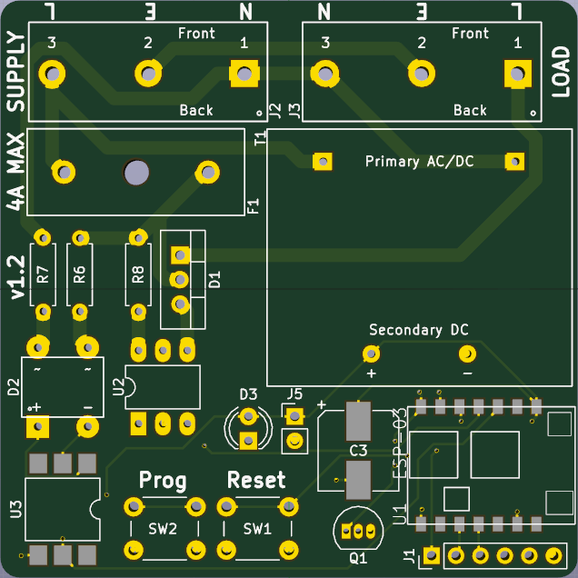

ESP8266 Light Dimmer
====================

KiCad Schematic and PCB Design for a ESP8266 / ESP-03 based light dimmer.

Tested as working - see revision history for more.

## Board Images

Front:

Back:

## Revision History:

### v1.2:

v1.2 is tested as working.

Fixes:

* Fix PSU Ordering - Secondary DC + and - pins swapped.
* U3 pad size corrected
* C3 470uF footprint corrected
* Add 3v3 + GND power inputs for programming without a mains connection
* PCB Layout reworked

Issues Not Yet Fixed:

* More space behind D1 (Triac) would be better, to allow for a larger heatsink.
* 3v3 + GND power inputs for programming without a mains connection should be labeled on the board.
### v1.1:

Fixes:

* Fix Traic Pin Ordering

Issues Not Yet Fixed:

* None

## References

* [Dimming Circuit](https://www.instructables.com/id/Arduino-controlled-light-dimmer-The-circuit/)
* [BoM Generator](https://github.com/SchrodingersGat/KiBoM)
